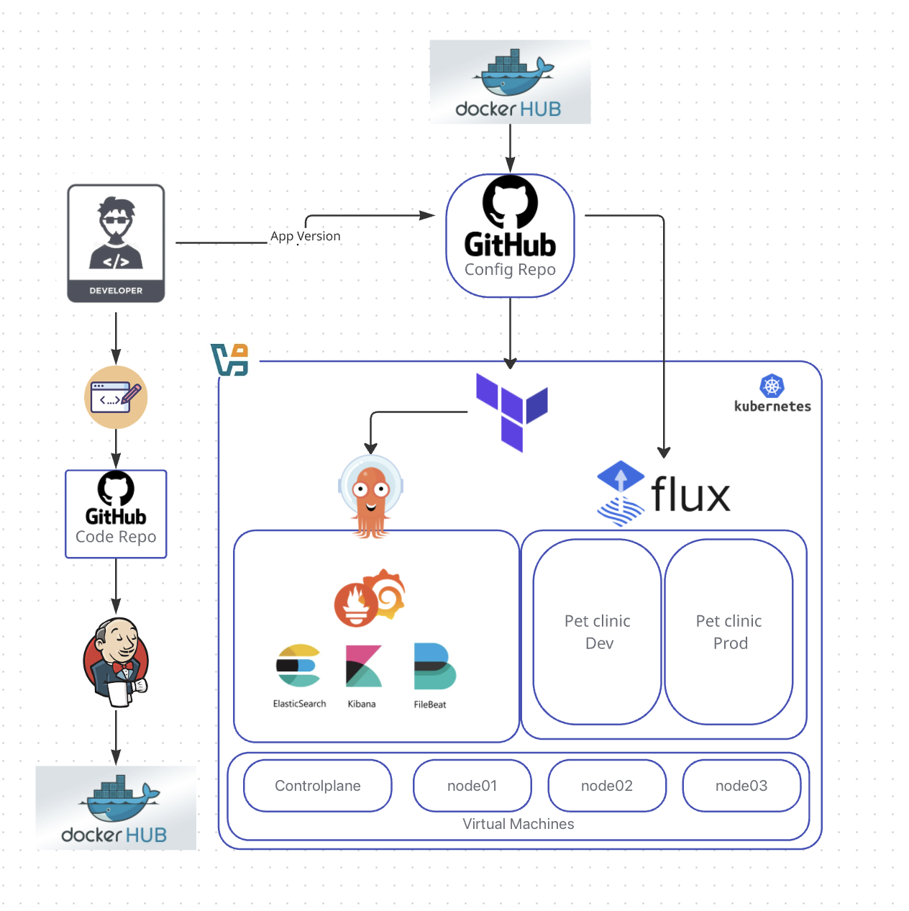

# petclinic-config 

## Architecture Diagram


---

## Repository Structure
```
.
├── README.md
├── app
│   ├── Chart.yaml
│   ├── templates
│   │   ├── _helpers.tpl
│   │   ├── deployment.yaml
│   │   ├── hpa.yaml
│   │   ├── ingress.yaml
│   │   └── service.yaml
│   └── values.yaml
├── clusters
│   └── my-cluster
│       ├── apps
│       │   ├── kustomization.yaml
│       │   ├── petclinic-dev
│       │   │   ├── helmrelease.yaml
│       │   │   └── kustomization.yaml
│       │   └── petclinic-prod
│       │       ├── helmrelease.yaml
│       │       └── kustomization.yaml
│       ├── flux-system
│       │   ├── apps.yaml
│       │   ├── gotk-components.yaml
│       │   ├── gotk-sync.yaml
│       │   ├── kustomization.yaml
│       │   └── namespaces.yaml
│       └── namespaces
│           ├── kustomization.yaml
│           ├── petclinic-dev.yaml
│           └── petclinic-prod.yaml
├── logging
│   ├── elasticsearch
│   │   ├── deployment.yaml
│   │   └── service.yaml
│   ├── filebeat
│   │   ├── configmap.yaml
│   │   ├── daemonset.yaml
│   │   ├── namespace.yaml
│   │   └── rbac.yaml
│   └── kibana
│       ├── deployment.yaml
│       ├── ingress.yaml
│       └── service.yaml
├── monitoring
│   ├── grafana
│   │   ├── configmap.yaml
│   │   ├── deployment.yaml
│   │   ├── ingress.yaml
│   │   ├── namespace.yaml
│   │   ├── pv.yaml
│   │   ├── pvc.yaml
│   │   └── service.yaml
│   └── prometheus
│       ├── configmap.yaml
│       ├── deployment.yaml
│       ├── ingress.yaml
│       ├── namespace.yaml
│       ├── node_exporter.yaml
│       ├── rbac.yaml
│       └── service.yaml
└── terraform
    └── argo
        ├── main.tf
        ├── modules
        │   ├── main.tf
        │   └── varriables.tf
        └── providers.tf
```
