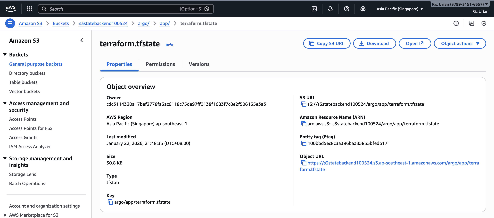
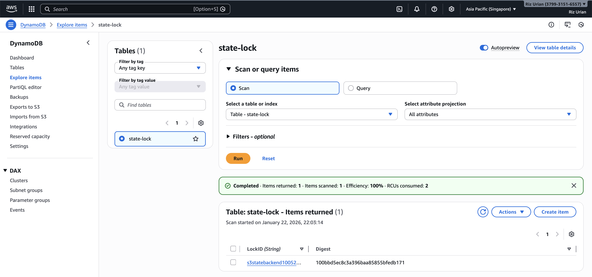

### Argo CD (Continuous Deployment)
- Deployed inside the Kubernetes cluster
- GitOps-based deployment model
- Automatically syncs Kubernetes manifests from GitHub
- Ensures the cluster state continuously matches the desired state

### Terraform (Argo CD Application Management)
- Terraform is used to **manage Argo CD Application resources**
- Argo CD applications are defined as **reusable Terraform modules**
- Responsibilities:
  - Create and update Argo CD Applications
  - Enforce consistent application configuration across environments
  - Avoid manual drift in Argo CD UI
- Terraform **does not deploy workloads directly**
  - Argo CD remains the single source of truth for Kubernetes state

### Terraform Backend (S3)

- Terraform state is stored in an S3 backend
- Enables safe, centralized state management
- Keeps infrastructure reproducible and version-controlled

  